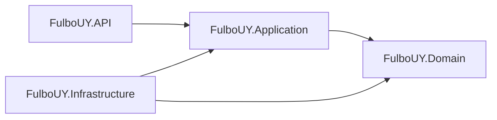

# Architecture

## Architecture Style

The backend follows a Clean Architecture style with separate projects for API, Application, Domain, and Infrastructure.

## Dependency Direction



## Layer Responsibilities

### Domain

Path: `src/FulboUY.Domain`

Owns:

- Entities.
- Enums.
- Core domain concepts.

Current entities:

- `User`
- `PlayerProfile`
- `Match`
- `MatchParticipant`
- `InviteLink`

### Application

Path: `src/FulboUY.Application`

Owns:

- Business services.
- Use case orchestration.
- Application DTOs.
- Repository and service interfaces.

Current services:

- `AuthService`
- `PlayerProfileService`
- `MatchService`
- `TeamBalancingService`
- `CostSplitService`

### Infrastructure

Path: `src/FulboUY.Infrastructure`

Owns:

- EF Core `AppDbContext`.
- Repository implementations.
- Migrations.
- SQL Server persistence details.

### API

Path: `src/FulboUY.API`

Owns:

- Controllers.
- HTTP request/response DTOs.
- Middleware.
- Authentication and authorization setup.
- Dependency injection setup.

### Frontend

Path: `client`

Owns:

- React pages.
- API client modules.
- Auth context.
- UI components.

## Folder Structure

```txt
src/
  FulboUY.API/
  FulboUY.Application/
  FulboUY.Domain/
  FulboUY.Infrastructure/
tests/
  FulboUY.Application.Tests/
client/
docs/
```

## Rules Per Layer

- Domain must not depend on infrastructure or API.
- Application should not depend on EF Core DbContext.
- Infrastructure should not contain business rules.
- API controllers should call services and map DTOs.
- Frontend should call API modules rather than hardcoding HTTP logic in pages when possible.

## Product CRUD / US15 Architecture Gap

Product CRUD / US15 currently has no vertical slice. Required pieces are To be defined and then implemented across Domain, Application, Infrastructure, API, and possibly frontend.
